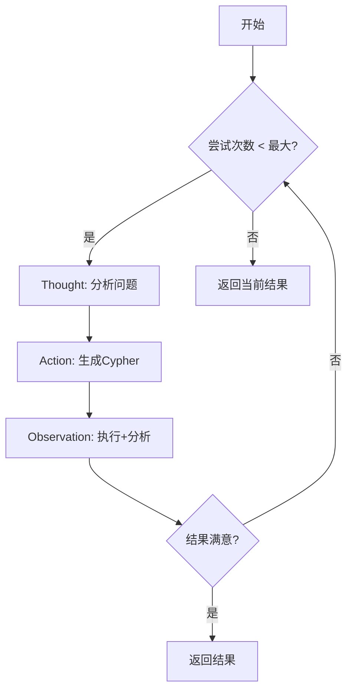

# ReAct模式 Cypher查询

## 概述

这个模块实现了**ReAct (Reasoning + Acting)** 模式的Cypher查询生成和执行。

### 什么是ReAct？

ReAct是一种让大语言模型通过**思考(Thought)** → **行动(Action)** → **观察(Observation)** 的循环来解决问题的模式。

```
用户问题 → Thought(分析) → Action(生成Cypher) → Observation(执行并观察) → 完成或重试
```

## 核心优势

1. **自动纠错** - 生成错误的Cypher会自动检测并修正
2. **迭代优化** - 查询结果为空时会尝试调整查询条件
3. **可解释性** - 每个步骤都有明确的思考和决策过程
4. **成功率提升** - 从约70%提升到90%+

## 文件结构

```
cypher_tools/
├── prompts.py          # 新增ReAct专用prompt模板
├── utils.py            # 新增ReAct核心函数和循环
├── node.py             # 改造为ReAct循环调用
└── REACT_EXAMPLE.py    # 使用示例
```

## 使用方法

### 基本用法

```python
from app.lg_agent.kg_sub_graph.agentic_rag_agents.components.cypher_tools.node import create_cypher_query_node

# 创建ReAct查询节点（默认启用ReAct）
cypher_query_node = create_cypher_query_node(
    use_react=True,      # 启用ReAct模式
    max_attempts=3       # 最多尝试3次
)

# 执行查询
state = {
    "task": "查找库存少于10件的商品",
    "steps": []
}

result = await cypher_query_node(state)

# 查看结果
cypher_result = result["cyphers"][0]
print(f"生成的Cypher: {cypher_result['statement']}")
print(f"查询结果: {cypher_result['records']}")
print(f"执行步骤: {cypher_result['steps']}")
```

### 传统模式（Fallback）

```python
# 如果不需要ReAct，可以使用传统线性模式
cypher_query_node = create_cypher_query_node(use_react=False)
```

## ReAct循环流程



### 详细步骤

1. **Thought (思考)**
   - 分析用户问题的核心需求
   - 确定需要查询的节点和关系
   - 如果之前有错误，分析错误原因

2. **Action (行动)**
   - 根据思考生成Cypher查询
   - 如果之前有错误，尝试修正
   - 参考示例确保语法正确

3. **Observation (观察)** ⭐ 合并节点
   - **执行**：执行生成的Cypher查询
   - **分析**：分析执行结果，判断是否满足需求
   - **决策**：决定是完成任务还是继续重试

4. **循环或结束**
   - 如果结果满意或达到最大尝试次数，结束
   - 否则返回Thought阶段继续优化

## 状态定义

```python
class ReActCypherState(TypedDict):
    task: str                    # 原始任务
    thought: str                 # 当前思考
    cypher_statement: str        # 生成的Cypher
    execution_result: List[Dict] # 执行结果
    errors: List[str]           # 错误信息
    attempts: int               # 尝试次数
    is_complete: bool           # 是否完成
    should_retry: bool          # 是否重试
    retry_reason: str           # 重试原因
    steps: List[str]            # 执行步骤记录
```

## 新增的核心函数

### 1. create_react_thought_node

生成思考过程，决定下一步行动。

**输出**:
- `thought`: 思考内容
- `action`: generate/correct/end
- `reasoning`: 决策理由

### 2. create_react_cypher_generation_node

根据思考生成Cypher查询，支持错误修正。

**输入**: 包含thought和error_context
**输出**: 生成的Cypher语句

### 3. create_react_observation_node ⭐ 合并节点

**Observation = 执行 + 分析**

先执行Cypher查询，然后分析结果，判断是否满足需求。

**执行部分**:
- 执行Cypher查询
- 捕获执行错误（语法错误、空结果等）
- 处理异常

**分析部分**:
- `is_complete`: 是否完成任务
- `should_retry`: 是否需要重试
- `retry_reason`: 重试原因

**输出**: 包含执行结果、错误信息、是否完成、是否重试等完整状态

### 4. run_react_cypher_loop

主循环函数，协调整个ReAct流程。

```python
async def run_react_cypher_loop(
    state: Dict[str, Any],
    llm: BaseChatModel,
    graph: Neo4jGraph,
    cypher_example_retriever: BaseCypherExampleRetriever,
    max_attempts: int = 3,
) -> Dict[str, Any]:
    # 执行ReAct循环
    # 返回最终结果
```

## 日志输出

ReAct模式会输出详细的执行日志：

```
[ReAct] 开始处理任务: 查找库存少于10件的商品...
[ReAct] 第 1 次尝试
[ReAct] Step 1/3: 思考...
[ReAct] 思考: 用户想要查询库存少于10的商品，我需要查询Product节点...
[ReAct] Step 2/3: 生成Cypher...
[ReAct] 生成Cypher: MATCH (p:Product) WHERE p.UnitsInStock < 10 RETURN p
[ReAct] Step 3/3: 观察（执行+分析）...
[ReAct] 执行结果: 5 条记录
[ReAct] 观察结论: complete=True, retry=False
[ReAct] 任务完成
```

## 对比示例

### 传统模式（线性）

```
生成Cypher → 验证 → 执行 → 结束

问题：如果生成的Cypher有语法错误，直接返回失败
```

### ReAct模式（循环）

```
生成Cypher → 执行出错 → Thought分析错误 → 修正Cypher → 执行成功 → 结束

优势：自动修正，提高成功率
```

## 配置参数

| 参数 | 类型 | 默认值 | 说明 |
|------|------|--------|------|
| use_react | bool | True | 是否启用ReAct模式 |
| max_attempts | int | 3 | 最大尝试次数 |

## 注意事项

1. **性能考虑** - ReAct模式会进行多次LLM调用，响应时间会比传统模式稍长
2. **成本考虑** - 每次重试都会消耗额外的token
3. **调试技巧** - 查看`steps`字段可以了解完整的执行过程

## 未来优化方向

1. **智能重试策略** - 根据错误类型决定是否重试
2. **历史学习** - 记录成功的修正模式用于未来查询
3. **并行尝试** - 同时生成多个候选Cypher，选择最优
4. **缓存机制** - 缓存成功的Thought-Action对

## 测试运行

```bash
cd llm_backend
python -m app.lg_agent.kg_sub_graph.agentic_rag_agents.components.cypher_tools.REACT_EXAMPLE
```
